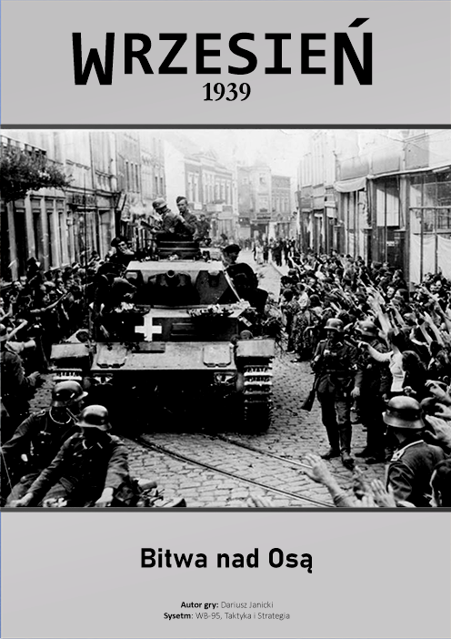

# Virtual WB-95
Virtual WB-95 to platforma do grania w autorskie scenariusze gier bitewnych, korzystających z silnika Vassal. Gry te oparte są na systemie Wielkie Bitwy 1939-1949 (WB-95) wydawnictwa Taktyka i Strategia.
Gry i instrukcje do systemu można zakupić m.in. tutaj:

* 👉 System WW3 Taktyka i Strategia https://taktykaistrategia.pl/kategoria-produktu/nasze-gry/?filter_system=b-xxi&query_type_system=or
* 👉 Sklep Taktyka i Strategia https://taktykaistrategiasklep.pl/


## 🔧 Jak uruchamiać

Do gry niezbędna jest aplikacja Vassal. Jest to darmowy silnik do uruchamiania wirtualnych gier planszowych. Można ją pobrać tutaj: https://vassalengine.org/download.html

* Pobierz i uruchom moduł **vWB-95.vmod**. Jest to podstawowa wersja gry, zawierająca jeden scenariusz - Bitwa nad Osą.

## 📁 Struktura repozytorium

``` yaml
Kryzys-2025/
│
├── vWB-95.vmod              # Podstawowy moduł Vassal – z jednym scenariuszem.
├── graphics/                # Wspólne zasoby: mapy, scenariusze, ikonki, itp.
└── saves/                   # Zapisy do gry (np. rozstawienie początkowe)
```

## 🎲 Scenariusze

